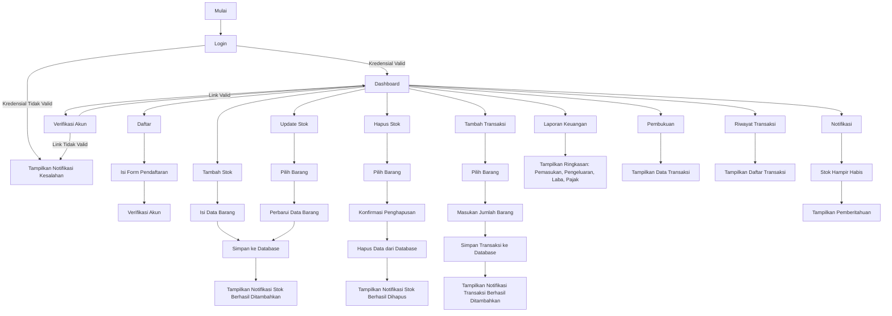

# Panduan Pengguna: Aplikasi Manajemen Finansial UMKM

## Prasyarat
Sebelum memulai, pastikan Anda memiliki:
- Android Studio
- Perangkat Virtual Android (AVD) atau Android Phone
- Internet yang memadai
- Download Project Versi terbaru di GitHub ini

## Cara Buka Project
1. **Salin URL GitHub Project**
   - Klik tombol <> Code → pilih HTTPS → Copy URL
   - https://github.com/alpinocode/ManajemenReportFinansialUmkm.git
2. **Buka Android Studio**
   - Jalankan Android Studio di PC/laptop kamu.
3. **Clone Project dari GitHub**
   - Di Android Studio, Klik File → New → Project from Version Control → Git
   - Paste URL GitHub yang tadi kamu salin ke kolom URL.
   - Pilih direktori lokal untuk menyimpan project.
   - Klik Clone.
4. **Tunggu Proses Download**
   - Android Studio akan otomatis meng-clone semua file project ke folder lokal.
   - Tunggu hingga semua file terdownload.
5. **Buka Project**
   - Setelah selesai clone, Android Studio biasanya langsung membuka project tersebut.
   - Kalau tidak, buka manual lewat: File → Open → pilih folder project hasil clone.
6. **Sync Gradle**
   - Tunggu Android Studio sync Gradle project.
   - Kalau ada tombol Sync Now muncul di atas, klik Sync Now.
   - Pastikan internet aktif karena mungkin perlu download library dependency dari build.gradle.
7. **Run / Build Project**
   - Pilih device emulator atau device Android kamu
   - Klik tombol Run ▶️ di Android Studio.

## Video Demo
Tonton video demo: [Tautan ke Video](https://youtube.com/shorts/caeJl8oK_ck?feature=share)

## Authors

- [@alpinocode](https://github.com/alpinocode)
- [@MrsAya](https://github.com/MrsAya)

## Flow Aplikasi

### 1. Login
1. **Pengguna membuka aplikasi**.
2. **Form Login** ditampilkan:
   - Input: Email/Username.
   - Input: Password.
4. **Validasi kredensial pengguna**:
   - Jika valid, pengguna diarahkan ke **Dashboard**.
   - Jika tidak valid, tampilkan notifikasi kesalahan.

---

### 2. Verifikasi (Verif)
1. **Pengguna mendaftar atau login pertama kali**.
2. Sistem mengirimkan **Link Verifikasi** melalui email.
3. **Pengguna Klik Link Verifikasi**:
   - Jika Link valid, pengguna diverifikasi.
   - Jika tidak valid, pengguna tidak diverifikasi.
4. Login Ulang pada Aplikasi

---

### 3. Daftar
1. **Pengguna menekan Tulisan "Create An Account"**.
2. Pengguna mengisi data:
   - Nama.
   - Email/Username.
   - Password.
   - Password Konfirmasi.
3. Sistem menyimpan data pengguna ke basis data.
4. Sistem mengarahkan ke proses **Verifikasi**.

---

### 4. Tambah Stok
1. **Pengguna membuka menu "Produk"**.
2. Klik tombol **"+"** pada kanan bawah.
3. Isi data barang:
   - Nama Suplier.
   - Nama Barang.
   - Code Barang.
   - Harga Beli.
   - Harga Jual.
   - Jumlah Stok.
   - Keterangan.
4. Sistem menyimpan data barang baru ke basis data.
5. Notifikasi: "Stok berhasil ditambahkan."

---

### 5. Update Stok
1. **Pengguna membuka menu "Produk"**.
2. Pilih barang yang ingin diperbarui.
3. Perbarui data barang:
   - Nama Suplier (Opsional).
   - Nama Barang (Opsional).
   - Code Barang (Opsional).
   - Harga Beli (Opsional).
   - Harga Jual (Opsional).
   - Jumlah Stok.
   - Keterangan (Opsional).
4. Sistem memperbarui data di basis data.
5. Notifikasi: "Stok berhasil diperbarui."

---

### 6. Hapus Stok
1. **Pengguna membuka menu "Produk"**.
2. Pilih barang yang ingin dihapus.
3. Klik tombol **Ikon Tempat Sampah**.
4. Konfirmasi penghapusan.
5. Sistem menghapus data dari basis data.
6. Notifikasi: "Stok berhasil dihapus."

---

### 7. Tambah Transaksi
1. **Pengguna membuka menu "Tambah Transaksi"**.
2. Pilih barang yang ingin dibeli.
3. Masukan **"Jumlah Barang"** yang dibeli
4. Sistem menyimpan data transaksi ke basis data.
5. Notifikasi: "Transaksi berhasil ditambahkan."

---

### 8. Laporan Keuangan
1. **Pengguna membuka menu "Laporan Keuangan"**.
2. Sistem menampilkan ringkasan:
   - Total Pemasukan.
   - Total Pengeluaran.
   - Laba Bersih.
   - Total Pajak.
3. Pengguna dapat melihatnya dalam bentuk Pie Chart.

---

### 9. Pembukuan
1. **Pengguna membuka menu "Pembukuan"**.
2. Sistem menampilkan data transaksi.

---

### 10. History Transaksi
1. **Pengguna membuka menu "Riwayat Transaksi"**.
2. Sistem menampilkan daftar transaksi:
   - Code Barang.
   - Nama Barang.
   - Jumlah Barang.
   - Tanggal Transaksi.
   - Total Harga.

---

### 11. Notifikasi
1. **Pengguna membuka menu "Notification"**.
2. Pemberitahuan untuk pengguna:
   - Ketika stok barang hampir habis.
3. Notifikasi ditampilkan di aplikasi.

---

### UI/UX APP
| Login | Rergister | Home | Request Email Verification |
|---------------|------------| ------------- |
|  | |  | 

